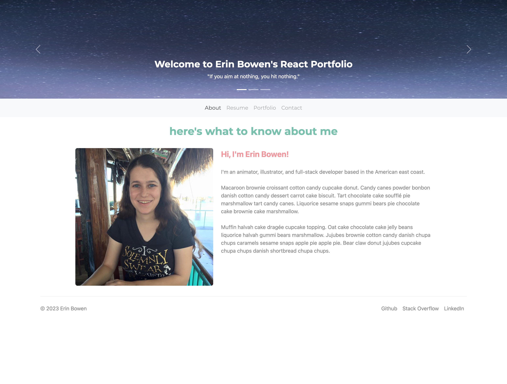
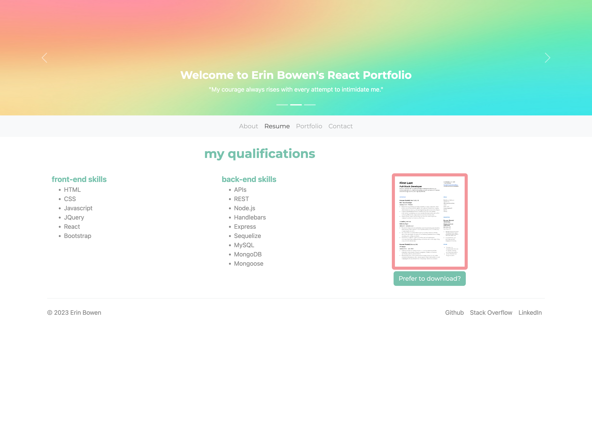
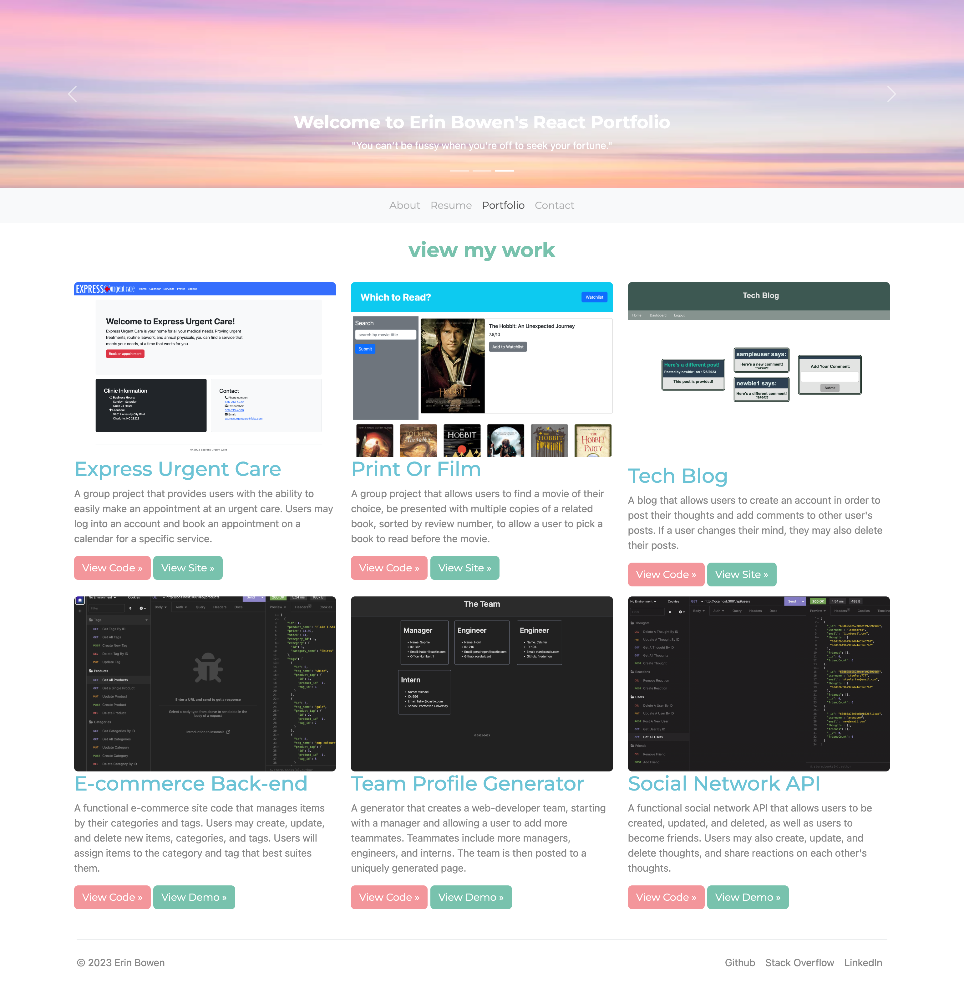
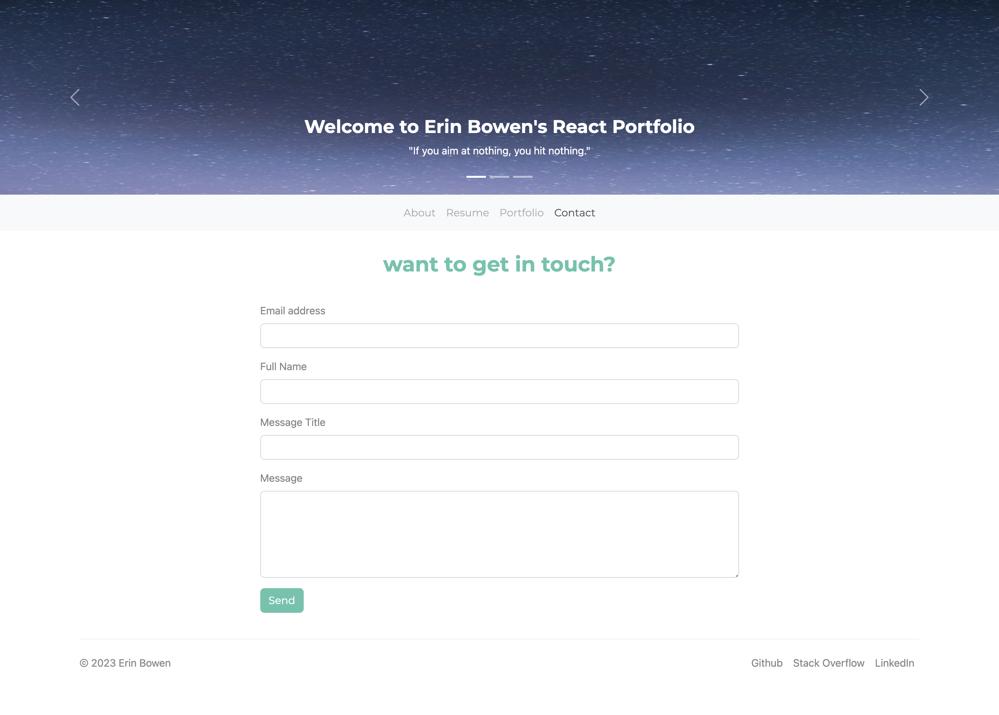

# Erin Bowen's React Portfolio

## Table of Contents
- [Description](#description)
- [Instructions](#instructions)
- [Technologies](#technologies)
- [Link](#link)
- [Visuals](#visuals)

## Description
This website is an example of a personal portfolio utilizing a one page layout on react. Users will start on the "About" page and see a picture and blurb of the owner of the website. On the resume page, users will be able to see a list of skills of the owner, as well as the option to download a PDF of their resume. On the portfolio page, users will be able to see an image of a website in the owner's portfolio, as well as a link to the live website or a video demo, and the repository. On the final page is a contact form where users may send an email to the owner of the website.

## Technology
This website uses several technologies with an emphasis on react. Other technologies include axios, bootstrap and bootwatch, and dotenv.

## Link
[Website](https://uiido.github.io/react-portfolio/)

[Repo](https://github.com/uiido/react-portfolio)

## Visuals

